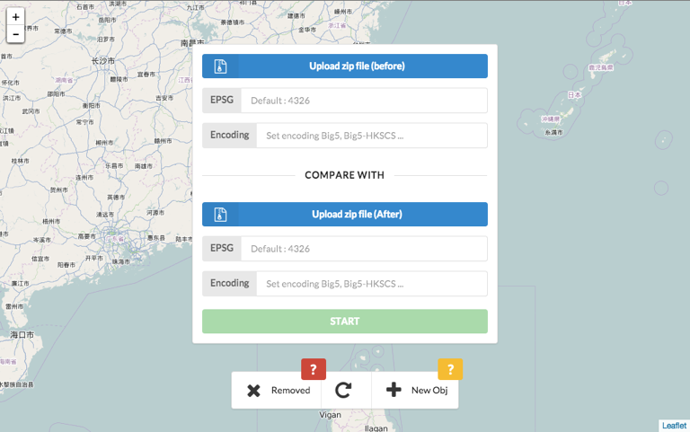

# compare2shp
Compares two shapefile and visualizes the comparison results. This comparison tool can highlight differences with geometry.

http://gipong.github.io/compare2shp/

# Usage
### prepare two shapefile 
First upload the ZIP archive (.shp, .dbf, .shx) you want to compare. It can compare two different versions of shapefile with geometry. Two options available if you need to set the EPSG or encoding for best fit to your data. You can skip EPSG code field if your ZIP archive contain the .prj file.

Test Data: [before.zip](file/before.zip), [after.zip](file/after.zip) (merge three polygons into one)

### find differences between two shapefile 
After comparing two shapefile, this map enables you to interact with before map and after map. It also provides a efficient way for users to show what differences between two shapefile on the map.

You can click on the select feature to show the attribute. 

# License
The MIT License (MIT)

Copyright (c) 2015 Gipong

Permission is hereby granted, free of charge, to any person obtaining a copy
of this software and associated documentation files (the "Software"), to deal
in the Software without restriction, including without limitation the rights
to use, copy, modify, merge, publish, distribute, sublicense, and/or sell
copies of the Software, and to permit persons to whom the Software is
furnished to do so, subject to the following conditions:

The above copyright notice and this permission notice shall be included in all
copies or substantial portions of the Software.

THE SOFTWARE IS PROVIDED "AS IS", WITHOUT WARRANTY OF ANY KIND, EXPRESS OR
IMPLIED, INCLUDING BUT NOT LIMITED TO THE WARRANTIES OF MERCHANTABILITY,
FITNESS FOR A PARTICULAR PURPOSE AND NONINFRINGEMENT. IN NO EVENT SHALL THE
AUTHORS OR COPYRIGHT HOLDERS BE LIABLE FOR ANY CLAIM, DAMAGES OR OTHER
LIABILITY, WHETHER IN AN ACTION OF CONTRACT, TORT OR OTHERWISE, ARISING FROM,
OUT OF OR IN CONNECTION WITH THE SOFTWARE OR THE USE OR OTHER DEALINGS IN THE
SOFTWARE.
